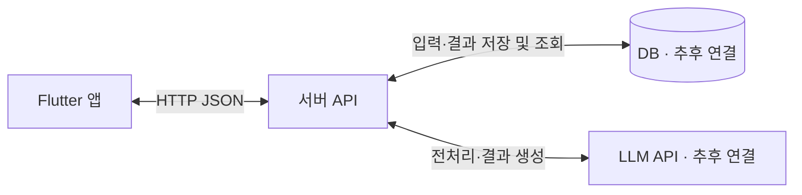

# KING · 모프

여러 사용자의 조건과 의견을 모아 함께 의사결정하는 Flutter 앱의 기본 프로젝트입니다. 앱과 서버를 하나의 저장소에서 각각 실행합니다.

## 큰 구조

```text
king/
├── apps/mobile/      Flutter 앱: 화면, 사용자 입력, 서버 요청
│   └── lib/
│       ├── main.dart             화면과 이동
│       ├── room.dart             데이터 모델
│       └── room_repository.dart  앱 단독 데모 / HTTP 연결
└── apps/server/      Node.js 개발용 서버
    └── src/
        ├── app.js    HTTP API와 오류 응답
        ├── store.js  임시 메모리 저장소 → 이후 DB로 교체
        └── llm.js    임시 결과 생성 → 이후 LLM API로 교체
```



앱은 서버에 입력을 보내고 결과를 받습니다. 서버가 DB와 LLM을 연결합니다. DB는 입력과 결과를 보관하는 저장소이며 LLM을 직접 호출하지 않습니다. LLM API 키와 DB 비밀번호는 서버에서만 관리합니다.

예정된 처리 순서: 앱 입력 → 서버에서 검증·LLM 전처리 → DB 저장 → 서버에서 의견 조회·LLM 결과 생성 → DB에 결과 저장 → 앱 출력.

현재는 DB·LLM 제공 업체와 배포 환경을 선택하지 않았습니다. Node.js 서버는 통신 구조를 확인하는 기본 구현이며 다른 서버 기술로 바꾸어도 HTTP 규격은 유지할 수 있습니다.

## 구현된 기본 흐름

- 시작 화면과 연결 정보
- 그룹 이름·주제·인원수 설정 및 6자리 코드 생성
- 코드로 기존 방 조회 및 입장
- 이름·조건·의견 입력, 안건별 중복 이름과 인원수 초과 검증
- 현재 모인 의견으로 임시 결과 확인
- 다음 안건 시작 및 이전 결과 보관
- 종료 후 안건별 결과 모음 확인

**실제 AI 분석이 아닌 입력 내용을 나열하는 임시 결과입니다.** 가입·로그인, 권한, 영구 저장, 자동 실시간 동기화는 아직 없습니다. 참여 인원은 현재 안건에 제출할 수 있는 서로 다른 이름의 수를 제한합니다. 실제 회원이나 접속자 수를 관리하지 않습니다. 결과 생성은 모든 인원이 제출하기 전에도 가능합니다.

## 실행

Flutter SDK와 Node.js 22 이상을 사용합니다. Flutter 대상은 Android, iOS, macOS입니다. macOS/iOS 빌드에는 Xcode가 필요합니다.

### 1. 앱만 실행 (가장 간단한 확인 방법)

저장소 루트에서:

```bash
cd apps/mobile
flutter pub get
flutter run -d macos
```

별도 서버 없이 데모 저장소를 사용합니다. 다른 기기와 방을 공유할 수 없으며 앱을 종료하면 데이터가 초기화됩니다. Android 에뮬레이터나 iOS 시뮬레이터를 사용할 때는 `flutter devices`로 확인한 ID를 `-d`에 넣습니다.

### 2. 앱과 로컬 서버 연결

첫 번째 터미널, 저장소 루트에서:

```bash
cd apps/server
npm start
```

두 번째 터미널, 저장소 루트에서:

```bash
cd apps/mobile
flutter run -d macos --dart-define=API_BASE_URL=http://127.0.0.1:3000
```

- Android 에뮬레이터는 `http://10.0.2.2:3000`을 사용합니다. HTTP 허용은 Android debug 설정에만 있습니다.
- iOS 시뮬레이터는 Mac의 로컬 서버 주소를 사용합니다. 실제 iOS 기기 연결은 네트워크 권한·HTTPS 설정을 별도로 구성해야 합니다.
- 다른 참여자의 의견은 방 화면의 새로고침 버튼으로 불러옵니다.
- 서버 재시작 시 방과 의견이 초기화됩니다.
- `API_BASE_URL`을 바꾼 뒤에는 앱을 다시 실행합니다.
- 서버는 기본적으로 `127.0.0.1:3000`에서만 실행합니다. 포트 변경 예: `PORT=3001 npm start`.

현재 서버는 인증 없이 코드를 아는 사용자가 방을 조회·변경할 수 있는 **로컬 개발용**입니다. 실제 공개 서비스 배포 전에 회원 인증과 방별 접근 권한, 요청 제한, 영구 저장을 연결해야 합니다. `.env` 파일은 자동으로 읽지 않으며 현재 설정은 셸 환경변수로 전달합니다.

## API 규격

| 요청 | 역할 | JSON 입력 |
| --- | --- | --- |
| `GET /health` | 서버 상태 | 없음 |
| `POST /rooms` | 방 생성 (201) | `name`, `topic`, `capacity` |
| `GET /rooms/:code` | 방 조회 및 입장 | 없음 |
| `POST /rooms/:code/opinions` | 의견 전처리 및 저장 | `author`, `condition`, `text` |
| `POST /rooms/:code/result` | 현재 안건 임시 결과 저장 | `{}` |
| `POST /rooms/:code/next` | 결과 보관 및 다음 안건 | `{}` |
| `POST /rooms/:code/finish` | 결과 보관 및 방 종료 | `{}` |

`/health` 이외의 성공 응답은 방 전체 객체입니다. 방은 `code`, `name`, `topic`, `capacity`, `round`, `closed`, `opinions`, `result`, `history` 필드를 포함합니다. `result`는 생성 전 `null`, 이후 문자열입니다. `history`는 `{round, result}` 배열입니다. 오류 응답은 `{ "error": "메시지" }`이며 400(입력 오류), 404(없음), 409(상태 충돌), 413(크기 초과)을 구분합니다.

## 검증

```bash
cd apps/server
npm test
```

```bash
cd apps/mobile
dart analyze lib test
flutter test
```

서버 API의 생성·공유·검증·안건 전환·종료와 앱 화면 흐름을 검사합니다. HTTP 연동 테스트에는 Node.js가 필요합니다.

## 다음 연결 지점

1. DB 선택 후 `MemoryRoomStore`를 영구 저장 구현으로 교체하고 비동기 처리·트랜잭션을 적용합니다.
2. `DemoLlm`을 실제 LLM 호출로 교체하고 시간 초과·재시도·결과 검증을 추가합니다.
3. 회원가입·로그인 및 방 소유자·참여자 권한을 연결합니다.
4. 필요하면 폴링 또는 실시간 구독으로 다른 참여자의 입력을 자동 반영합니다.

참고 화면 PDF는 상위 `모프` 폴더에서 별도로 관리하며 저장소에 포함하지 않았습니다.
